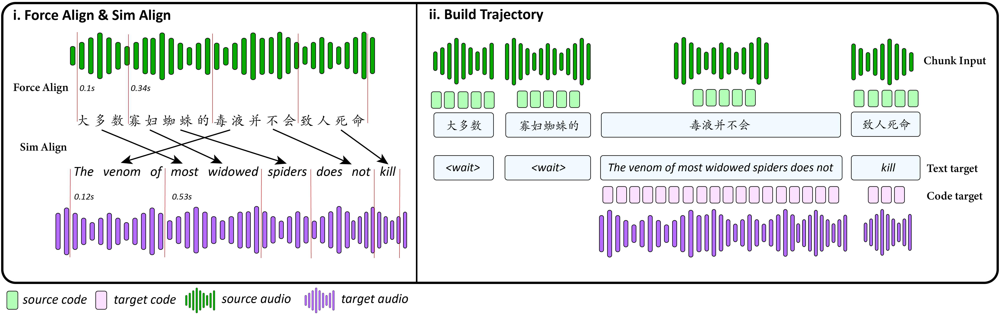
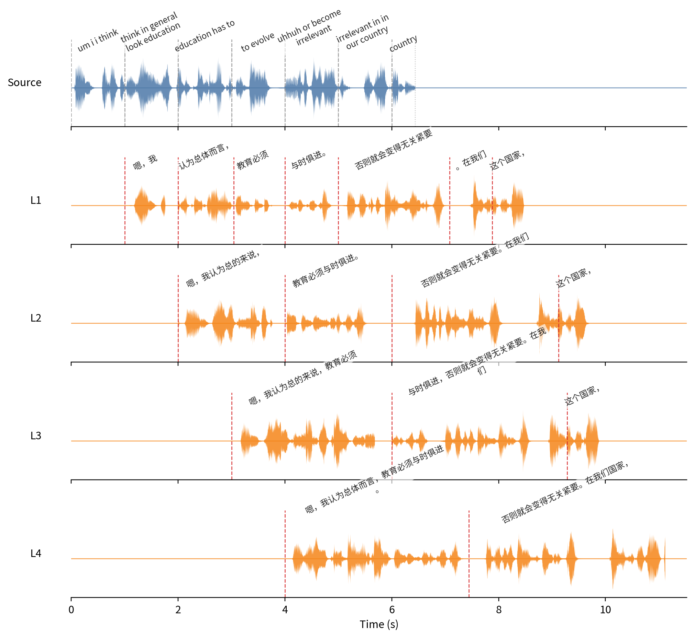
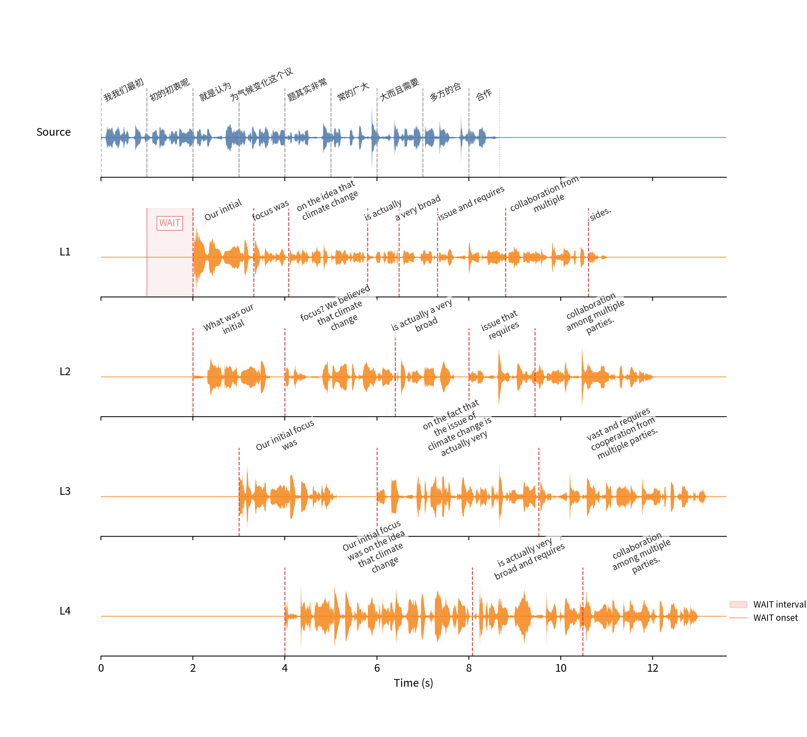

# SimulS2ST-Omni: Data-Efficient Streaming Speech-to-Speech Translation via Explicit Trajectory Supervision

[](https://arxiv.org/abs/2607.19810)
[](https://huggingface.co/HA-SA-ki/SimulS2ST-Omni)
[](https://hasaki321.github.io/SimulS2ST-Omni.demo/)
[](#chrome-extension)

## Overview

This repository contains the official inference code and interactive demos for
our paper, **“SimulS2ST-Omni: Data-Efficient Streaming Speech-to-Speech
Translation via Explicit Trajectory Supervision.”**

SimulS2ST-Omni enables sentence-level and long-form Chinese–English streaming
speech-to-speech translation using approximately 2,000 hours of paired S2ST
data. It combines a Qwen2.5-Omni thinker, an OmniTalker semantic-code talker,
and a VoiceBox/Vocos waveform decoder through explicit joint text-code
trajectory supervision.

<p align="center">
  
</p>

## News

- **August 21, 2026:** SimulS2ST-Omni was accepted to the EMNLP 2026 Main Conference.

## Demo

### Live streaming

<p align="center">
  <a href="https://hasaki321.github.io/SimulS2ST-Omni.demo/">
    
  </a>
</p>

<p align="center">
  <a href="https://hasaki321.github.io/SimulS2ST-Omni.demo/">▶ Watch the live demo</a>
</p>

This live demo was recorded with the included [Chrome extension](#chrome-extension).
Run the model server and enable the extension to experience interactive streaming
translation on [YouTube](https://www.youtube.com/) or
[Bilibili](https://www.bilibili.com/).

## Sentence-Level Visualizations

<table>
  <tr>
    <td align="center" width="50%">
      
      <br/><strong>English → Chinese</strong>
    </td>
    <td align="center" width="50%">
      
      <br/><strong>Chinese → English</strong>
    </td>
  </tr>
</table>

- **English → Chinese:** [source audio](demo/assets/sentence_visualizations/sentence/pred/en2zh/04/source_04.wav) · [sample directory](demo/assets/sentence_visualizations/sentence/pred/en2zh/04/)
- **Chinese → English:** [source audio](demo/assets/sentence_visualizations/sentence/pred/zh2en/08/source_08.wav) · [sample directory](demo/assets/sentence_visualizations/sentence/pred/zh2en/08/)

## Clone

```bash
git clone --recurse-submodules https://github.com/hasaki321/SimulS2ST-Omni.git
cd SimulS2ST-Omni
```

For an existing checkout:

```bash
git submodule update --init --recursive
```

The SimulEval submodule is pinned to commit
`536de8253b82d805c9845440169a5010ff507357`.

## Requirements

- Linux x86_64
- Python 3.10
- NVIDIA GPU with a CUDA 12.x-compatible driver; Ampere or newer recommended
- `ffmpeg` on `PATH`
- Conda, Miniconda, or Mamba

Create a clean environment:

```bash
conda create -n simuls2st-omni python=3.10 pip setuptools=80.10.2 wheel
conda activate simuls2st-omni

pip install torch==2.6.0 torchvision==0.21.0 torchaudio==2.6.0 \
  --index-url https://download.pytorch.org/whl/cu124
pip install -r requirements.txt
pip install -e external/SimulEval
```

The exact release environment is recorded in `requirements.lock.txt`. Prefer
`requirements.txt` for a fresh installation.

## Model assets

Download the companion [Hugging Face model repository](https://huggingface.co/HA-SA-ki/SimulS2ST-Omni)
into `models/SimulS2ST-Omni`. Model assets are not stored in the code repository.

```bash
hf download HA-SA-ki/SimulS2ST-Omni \
  --local-dir models/SimulS2ST-Omni
```

| Asset | Default path |
|---|---|
| Offline merged model | `models/SimulS2ST-Omni/offline` |
| Simultaneous S2ST adapter | `models/SimulS2ST-Omni/simuls2st_adapter` |
| VoiceBox | `models/SimulS2ST-Omni/voicebox/voicebox.safetensors` |
| Vocos | `models/SimulS2ST-Omni/voicebox/vocos.safetensors` |
| VoiceBox config | `models/SimulS2ST-Omni/voicebox/voicebox_config.json` |
| DualCodec | `models/SimulS2ST-Omni/dualcodec/dualcodec.safetensors` |
| Codec statistics | `models/SimulS2ST-Omni/dualcodec/w2v_bert_stats.pt` |
| W2V-BERT feature model | `models/SimulS2ST-Omni/w2v` |

Set `SIMULS2ST_MODEL_ROOT` to use a different model-package location. Individual
decoder paths can also be set with `SIMULS2ST_VOICEBOX_PATH`,
`SIMULS2ST_VOCOS_PATH`, `SIMULS2ST_CODEC_MODEL_PATH`,
`SIMULS2ST_CODEC_STATS_PATH`, and `SIMULS2ST_W2V_BERT_PATH`.

## Inference

The release provides one offline entry point for ASR, TTS, S2TT, and S2ST, plus
SimulEval agents for streaming S2TT and S2ST. Run all commands from the repository
root.

### Offline ASR, TTS, S2TT, and S2ST

ASR writes the transcription to a JSON file:

```bash
CUDA_VISIBLE_DEVICES=0 python -m src.inference.run_offline \
  --task asr \
  --audio /path/to/english.wav \
  --source-lang English \
  --output outputs/asr.json
```

S2TT writes the translated text to a JSON file:

```bash
CUDA_VISIBLE_DEVICES=0 python -m src.inference.run_offline \
  --task s2tt \
  --audio /path/to/english.wav \
  --source-lang English --target-lang Chinese \
  --output outputs/s2tt.json
```

TTS uses a reference voice and writes a 24 kHz WAV file. Supplying `--ref-text`
selects unpaired in-context prompting; omit it to use paired prompting. Sampling
is recommended so that the codec sequence emits its end token reliably.

```bash
CUDA_VISIBLE_DEVICES=0 python -m src.inference.run_offline \
  --task tts \
  --audio /path/to/reference.wav \
  --ref-text "Transcript of the reference speech." \
  --text "Text to synthesize." \
  --source-lang English --target-lang English \
  --sample \
  --output outputs/tts.wav
```

S2ST translates the input speech and writes both `outputs/s2st.wav` and a sidecar
`outputs/s2st.json` containing the intermediate translated text:

```bash
CUDA_VISIBLE_DEVICES=0 python -m src.inference.run_offline \
  --task s2st \
  --audio /path/to/english.wav \
  --source-lang English --target-lang Chinese \
  --output outputs/s2st.wav
```

Use `--model-path`, `--checkpoint-path`, and the VoiceBox/Vocos path options when
the model package is stored outside its default location.

### Streaming S2TT

Prepare a UTF-8 `source.txt` containing one absolute or repository-relative audio
path per line and a matching `target.txt` containing one reference translation per
line. The following example decodes English speech into streaming Chinese text:

```bash
export PYTHONPATH="${PWD}:${PWD}/external/SimulEval"
CUDA_VISIBLE_DEVICES=0 python -m simuleval.cli \
  --agent src/agents/simuleval_omni_talker_s2tt_agent.py \
  --source-segment-size 1000 \
  --model-name-or-path models/SimulS2ST-Omni/offline \
  --checkpoint-path models/SimulS2ST-Omni/simuls2st_adapter \
  --source source.txt \
  --target target.txt \
  --output outputs/streaming_s2tt_L2 \
  --source-lang English --target-lang Chinese \
  --latency-multiplier 2 \
  --sacrebleu-tokenizer zh --eval-latency-unit char
```

### Streaming S2ST

Use the same `source.txt` and `target.txt` files for streaming speech output:

```bash
export PYTHONPATH="${PWD}:${PWD}/external/SimulEval"
CUDA_VISIBLE_DEVICES=0 python -m simuleval.cli \
  --agent src/agents/simuleval_omni_talker_s2st_agent.py \
  --source-segment-size 1000 \
  --model-name-or-path models/SimulS2ST-Omni/offline \
  --checkpoint-path models/SimulS2ST-Omni/simuls2st_adapter \
  --source source.txt \
  --target target.txt \
  --output outputs/example_L2 \
  --source-lang English --target-lang Chinese \
  --latency-multiplier 2 \
  --sacrebleu-tokenizer zh --eval-latency-unit char \
  --history-window-turns 28 --history-overlap-turns 16 \
  --prompt-source-chunks 2 --prompt-generated-chunks 1 \
  --thinker-max-new-tokens 256 --talker-max-new-tokens 500 \
  --thinker-no-sample --talker-no-sample \
  --thinker-num-beams 4 \
  --thinker-repetition-penalty 1.2 --thinker-no-repeat-ngram-size 5 \
  --talker-repetition-penalty 1.4 --talker-no-repeat-ngram-size 5 \
  --computation-aware \
  --no-scoring
```

For Chinese-to-English, use `--source-lang Chinese --target-lang English`,
`--sacrebleu-tokenizer 13a`, and `--eval-latency-unit word`.

## WebSocket demo

Start the server:

```bash
DEVICE=cuda:0 bash demo/run_server.sh
```

In another terminal, stream a WAV file in real time:

```bash
INPUT=/path/to/16khz-mono.wav bash demo/run_file_client.sh
```

The translated audio is written to `outputs/demo/file_client_out.wav`.
See `demo/README.md` for protocol details and optional arguments.

## Chrome extension

The unpacked Manifest V3 extension is in `demo/chrome_extension`:

1. Open `chrome://extensions`.
2. Enable **Developer mode**.
3. Click **Load unpacked** and select `demo/chrome_extension`.
4. Start the local WebSocket server, open the extension, and translate the
   active tab.

The directory can also be packaged as a ZIP and attached to a GitHub Release.
Publishing through the Chrome Web Store requires a separate review process.

## Acknowledgements

This release uses components from
[FlexiVoice](https://arxiv.org/abs/2601.04656) and
[DualCodec](https://arxiv.org/abs/2505.13000). We thank their authors for their
contributions to the speech-generation community.

## Citation

```bibtex
@misc{he2026simuls2stomnidataefficientstreamingspeechtospeech,
  title        = {SimulS2ST-Omni: Data-Efficient Streaming Speech-to-Speech Translation via Explicit Trajectory Supervision},
  author       = {Rongshen He and Xinyu Liang and Dekun Chen and Jiaqi Li and Mingjie Chen and Zhizheng Wu},
  year         = {2026},
  eprint       = {2607.19810},
  archivePrefix = {arXiv},
  primaryClass = {cs.SD},
  url          = {https://arxiv.org/abs/2607.19810},
}
```

## License

The SimulS2ST-Omni source code is released under the [MIT License](LICENSE).
SimulEval and other third-party components remain subject to their respective
upstream licenses. Model weights are released separately under Apache-2.0.
